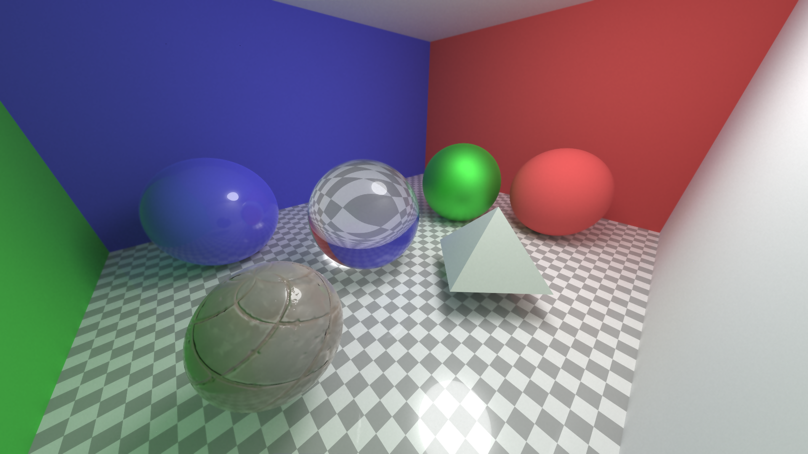
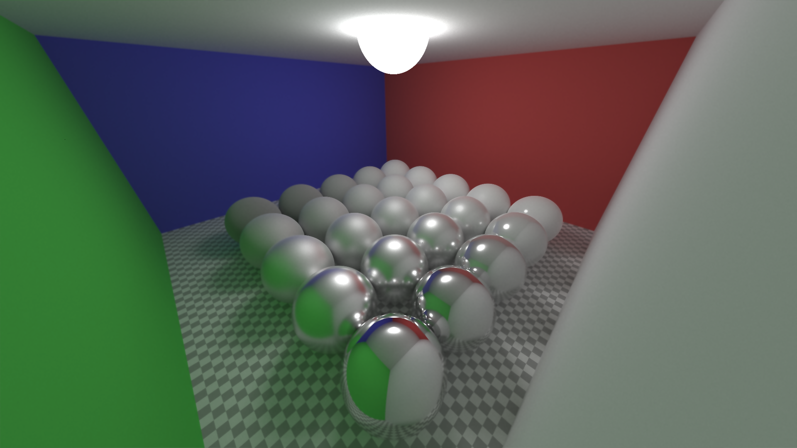

# Ray Tracer

A physically based CPU/GPU ray tracer written in C++ and OpenGL (GLSL).

The renderer supports Monte Carlo path tracing with physically based materials, importance sampling, BVH acceleration, textured meshes and progressive accumulation.



---

## Features

- Physically Based Rendering (PBR)
- Monte Carlo path tracing
- Multiple Importance Sampling (MIS)
- Next Event Estimation (NEE)
- GGX microfacet BRDF
- VNDF importance sampling
- Metallic / Roughness workflow
- Lambertian, metallic and dielectric materials
- HDR sky illumination
- Sphere lights
- Progressive accumulation
- Bounding Volume Hierarchy (BVH)
- Triangle mesh rendering
- OBJ model loading
- Texture mapping
- Normal mapping
- Glass rendering

---

## Gallery

| Cornell-like scene | Metallic materials |
|--------------------|--------------------|
|  |  |

---

## Build

Requirements:

- C++17
- OpenGL 3.3+
- CMake
- GLFW
- GLAD

Clone the repository

```bash
git clone https://github.com/username/ray-tracer.git
cd ray-tracer
```

Build

```bash
mkdir build
cd build
cmake ..
cmake --build .
```

Run

```bash
./rtx
```

---

## Implemented techniques

- Path tracing
- Direct light sampling
- Multiple Importance Sampling
- GGX BRDF
- Smith masking-shadowing
- Schlick Fresnel approximation
- Cosine-weighted hemisphere sampling
- Visible Normal Distribution Function (VNDF) sampling
- Russian roulette termination (planned)

---

## Project structure

```
src/
    Renderer/
    Scene/
    BVH/
    ModelLoader/
    Shaders/
assets/
models/
textures/
```


---

## License

MIT License.
